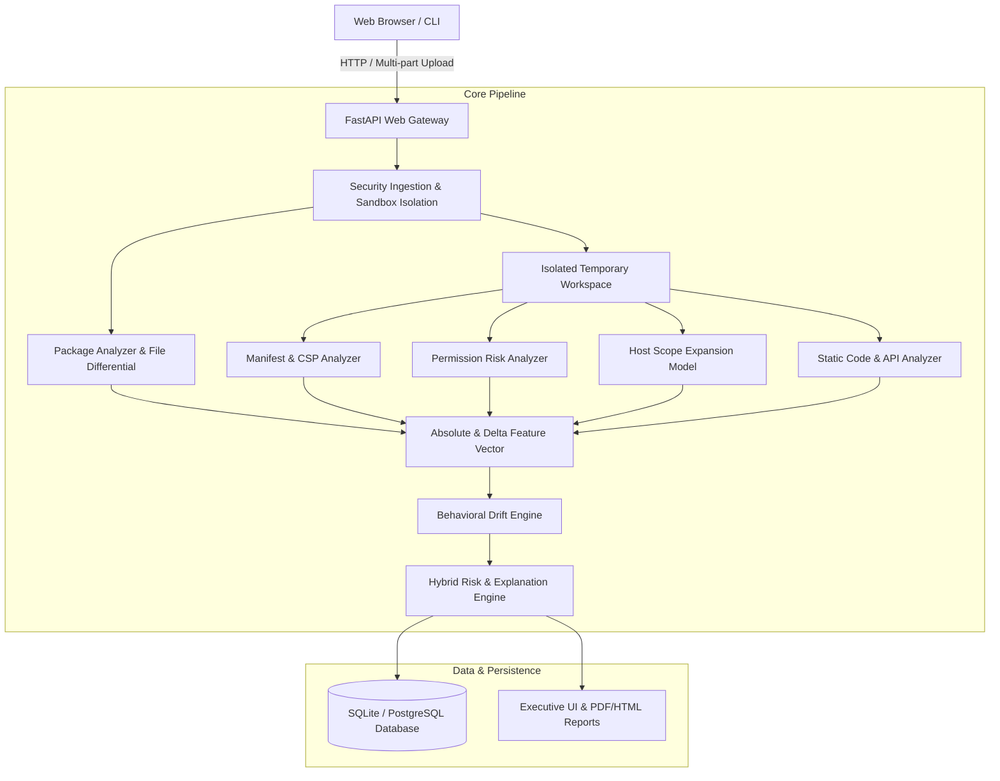

# DriftWatch Architecture Specifications

## 1. System Architecture Diagram

## 2. Component Descriptions

### 2.1 Security & Ingestion (`app/core/security.py`)
- Enforces archive limits: 25 MB max archive size, 100 MB uncompressed, 10:1 max compression ratio, 500 max files.
- Prevents Zip-Slip path traversal attacks by validating resolved destination paths against parent workspace bounds.
- Calculates SHA-256 digests for package files and full archives.

### 2.2 Manifest & Permission Analyzer (`analyzers/`)
- Evaluates `manifest.json` (V2 and V3).
- Identifies added/removed permissions, optional permissions, host permissions, background service workers, and content scripts.
- Categorizes permissions into severity levels: `Informational`, `Low`, `Moderate`, `High`, `Critical`.

### 2.3 Host Scope Expansion Model (`analyzers/host_scope_analyzer.py`)
- Formally models host permissions as pattern expansion graphs.
- Scores transitions:
  - Specific path -> Entire domain
  - Specific domain -> Wildcard subdomains (`*.example.com`)
  - HTTP only -> HTTP + HTTPS
  - Any domain -> `<all_urls>` or `*://*/*`

### 2.4 Hybrid Risk & Scoring Engine (`risk_engine/`)
- Calculates normalized risk score (0 - 100).
- Assigns Risk Classification: `Low`, `Moderate`, `High`, `Critical`.
- Generates human-readable evidence chains, technical root causes, and security recommendations.

### 2.5 Phase 2 Static Analysis Modules (`analyzers/`)
- `javascript_parser.py` provides safe lexical preprocessing. It removes comments while preserving single-quoted, double-quoted, and template literal strings, including URL strings containing `//`.
- `api_analyzer.py` extracts newly introduced browser API and network-sink calls from executable JavaScript text. Strings and comments are masked before API matching.
- `network_analyzer.py` extracts HTTP(S), WebSocket, domain, IPv4, port, direct sink destination, localhost/test, and bounded decoded Base64 endpoint indicators.
- `obfuscation_analyzer.py` detects static dynamic-code and string-encoding indicators such as `eval`, `new Function`, `atob`, escaped strings, high entropy strings, and WebAssembly files.
- `structure_analyzer.py` reports formatting-resistant structural drift and source-to-sink heuristic indicators within the same file.

### 2.6 Partial Analysis Behavior
Manifest, package, and permission analysis are required for a meaningful comparison. Phase 2 code analyzers are isolated: if one fails, DriftWatch records an analyzer-specific error and returns the remaining partial analysis instead of failing the whole report.

### 2.7 Score Breakdown
The report stores and exposes category-level score contributions:
`permission_contribution`, `host_contribution`, `api_contribution`, `network_contribution`, `obfuscation_contribution`, `structural_contribution`, and `combination_contribution`.

### 2.8 DriftBench Phase 3A (`driftbench/`)
- `labels.py` defines the operational label ontology.
- `schema.py` defines version-pair and provenance metadata records.
- `provenance.py` provides SHA-256 archive provenance helpers.
- `validator.py` validates dataset metadata, labels, hashes, timestamps, and split leakage without executing extension code.
- `mutations.py` creates controlled synthetic laboratory updates from local samples.
- `splits.py` creates group-aware random and chronological splits by `extension_id`.

Phase 3A is methodology and data-engineering infrastructure only. It does not train ML models or report empirical detection metrics.

### 2.9 DriftBench Phase 3B Feature Pipeline
- `driftbench/features.py` validates dataset records, safely extracts archives through `SecureExtractor`, reuses static analyzers, and emits deterministic feature rows.
- Five feature representations are supported: permission-only, manifest+permission, latest-version-only static, simple differential, and full DriftWatch behavioural drift.
- Feature schema version `1.0` documents feature name, family, type, analyzer source, baseline membership, and missing-value behavior.
- CSV and JSONL artifacts are written per representation, with metadata columns separated from feature columns.
- Extraction manifests preserve record count, label counts, split counts, schema version, dataset identifier/version, warnings, failed records, and seed/code-version metadata where available.

The feature pipeline does not train models, compute ML metrics, or use final risk score/classification as features.
