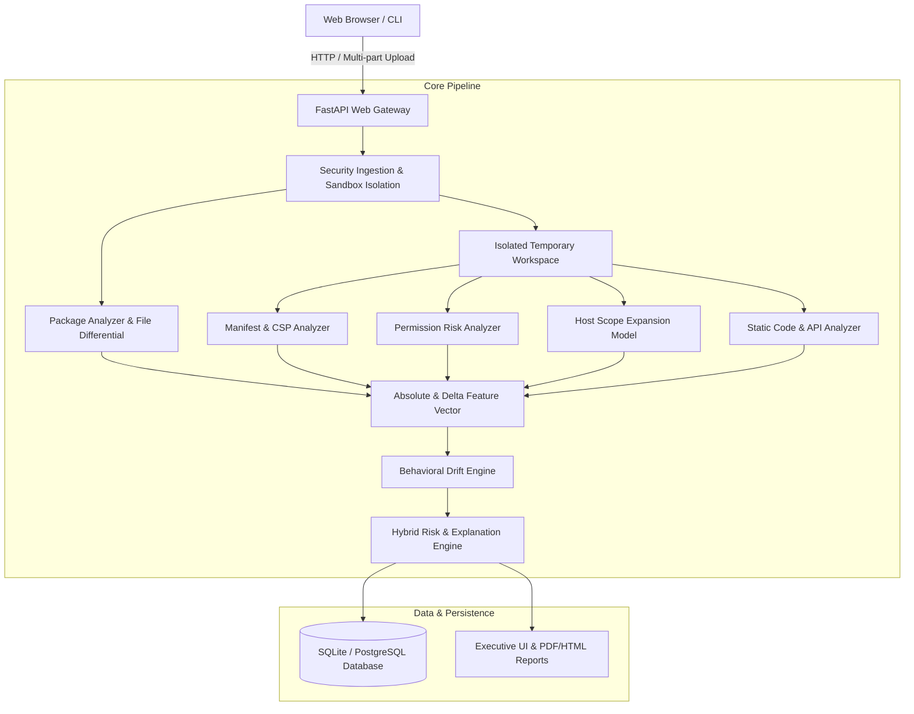

# DriftWatch Architecture Specifications

## 1. System Architecture Diagram

## 2. Component Descriptions

### 2.1 Security & Ingestion (`app/core/security.py`)
- Enforces archive limits: 25 MB max archive size, 100 MB uncompressed, 10:1 max compression ratio, 500 max files.
- Prevents Zip-Slip path traversal attacks by validating resolved destination paths against parent workspace bounds.
- Calculates SHA-256 digests for package files and full archives.

### 2.2 Manifest & Permission Analyzer (`analyzers/`)
- Evaluates `manifest.json` (V2 and V3).
- Identifies added/removed permissions, optional permissions, host permissions, background service workers, and content scripts.
- Categorizes permissions into severity levels: `Informational`, `Low`, `Moderate`, `High`, `Critical`.

### 2.3 Host Scope Expansion Model (`analyzers/host_scope_analyzer.py`)
- Formally models host permissions as pattern expansion graphs.
- Scores transitions:
  - Specific path -> Entire domain
  - Specific domain -> Wildcard subdomains (`*.example.com`)
  - HTTP only -> HTTP + HTTPS
  - Any domain -> `<all_urls>` or `*://*/*`

### 2.4 Hybrid Risk & Scoring Engine (`risk_engine/`)
- Calculates normalized risk score (0 - 100).
- Assigns Risk Classification: `Low`, `Moderate`, `High`, `Critical`.
- Generates human-readable evidence chains, technical root causes, and security recommendations.

### 2.5 Phase 2 Static Analysis Modules (`analyzers/`)
- `javascript_parser.py` provides safe lexical preprocessing. It removes comments while preserving single-quoted, double-quoted, and template literal strings, including URL strings containing `//`.
- `api_analyzer.py` extracts newly introduced browser API and network-sink calls from executable JavaScript text. Strings and comments are masked before API matching.
- `network_analyzer.py` extracts HTTP(S), WebSocket, domain, IPv4, port, direct sink destination, localhost/test, and bounded decoded Base64 endpoint indicators.
- `obfuscation_analyzer.py` detects static dynamic-code and string-encoding indicators such as `eval`, `new Function`, `atob`, escaped strings, high entropy strings, and WebAssembly files.
- `structure_analyzer.py` reports formatting-resistant structural drift and source-to-sink heuristic indicators within the same file.

### 2.6 Partial Analysis Behavior
Manifest, package, and permission analysis are required for a meaningful comparison. Phase 2 code analyzers are isolated: if one fails, DriftWatch records an analyzer-specific error and returns the remaining partial analysis instead of failing the whole report.

### 2.7 Score Breakdown
The report stores and exposes category-level score contributions:
`permission_contribution`, `host_contribution`, `api_contribution`, `network_contribution`, `obfuscation_contribution`, `structural_contribution`, and `combination_contribution`.

### 2.8 DriftBench Phase 3A (`driftbench/`)
- `labels.py` defines the operational label ontology.
- `schema.py` defines version-pair and provenance metadata records.
- `provenance.py` provides SHA-256 archive provenance helpers.
- `validator.py` validates dataset metadata, labels, hashes, timestamps, and split leakage without executing extension code.
- `mutations.py` creates controlled synthetic laboratory updates from local samples.
- `splits.py` creates group-aware random and chronological splits by `extension_id`.

Phase 3A is methodology and data-engineering infrastructure only. It does not train ML models or report empirical detection metrics.

### 2.9 DriftBench Phase 3B Feature Pipeline
- `driftbench/features.py` validates dataset records, safely extracts archives through `SecureExtractor`, reuses static analyzers, and emits deterministic feature rows.
- Five feature representations are supported: permission-only, manifest+permission, latest-version-only static, simple differential, and full DriftWatch behavioural drift.
- Feature schema version `1.0` documents feature name, family, type, analyzer source, baseline membership, and missing-value behavior.
- CSV and JSONL artifacts are written per representation, with metadata columns separated from feature columns.
- Extraction manifests preserve record count, label counts, split counts, schema version, dataset identifier/version, warnings, failed records, and seed/code-version metadata where available.

The feature pipeline does not train models, compute ML metrics, or use final risk score/classification as features.

### 2.10 Phase 3C Research Evaluation Layer (`research/`)
- `loaders.py` reads Phase 3B CSV artifacts and separates metadata from feature columns.
- `readiness.py` checks whether the dataset is large enough, split correctly, non-duplicate, and sufficiently real to permit ML training.
- `leakage.py` audits feature names and feature values for target-derived, path-derived, split-derived, and final-score-derived leakage indicators.
- `metrics.py` computes binary confusion-matrix metrics including precision, recall, F1, balanced accuracy, FPR, FNR, and false alerts per 100 benign updates.
- `baselines.py` runs deterministic pilot rules for the five Phase 3B feature representations.
- `experiment_config.py`, `chronological.py`, and `ablation.py` validate experiment configuration, chronological eligibility, and feature-family removal plans.
- `train_logistic.py` and `train_random_forest.py` provide gated, deterministic sklearn training routines for future datasets that pass readiness and leakage checks.
- `evaluate.py` writes reproducible experiment artifacts under `artifacts/experiments/`.

The current Phase 3C artifact set is a controlled pilot only. ML training is blocked by the readiness gate until there are enough real, leakage-safe records with valid train/test or chronological split assignments.

### 2.11 Phase 3D Dataset Curation Layer (`driftbench/`)
- `governance.py` defines source categories, license statuses, dataset lifecycle stages, data-quality statuses, and DriftBench dataset versioning.
- `intake.py` reads local import manifests, validates provenance/licensing/identity/version order, computes raw package SHA-256 hashes, and separates accepted, quarantined, and excluded records.
- `versioning.py` orders versions using trustworthy timestamps where available and semantic version parsing as a fallback.
- `duplicates.py` detects duplicate record IDs, duplicate extension version pairs, and duplicate package hashes.
- `split_audit.py` checks protected train/validation/test boundaries for extension identity, package-hash, and controlled-mutation-family leakage.
- `manifests.py` writes machine-readable dataset, provenance, quality, duplicate, leakage, license, and validation reports.
- `review.py` stores evidence-based manual review forms without treating DriftWatch score as the label source.

Phase 3D curation produces existing `DatasetPairRecord` objects for Phase 3B feature extraction. It does not duplicate feature logic, execute extension code, perform live scraping, or retrain ML models.

### 2.12 Phase 3D.5 Real Pilot Acquisition
- `acquisition.py` validates HTTPS acquisition URLs, sanitizes filenames, enforces download size limits, and normalizes ZIP layouts for static analysis.
- Normalization preserves raw package SHA-256 and normalized analysis-package SHA-256 separately.
- `real_pilot.py` builds the real pilot readiness report from curation, duplicate, leakage, provenance, and feature-extraction artifacts.

Phase 3D.5 uses the Phase 3D intake records and the Phase 3B feature extractor. It does not add a new feature schema and does not train or deploy ML models.

### 2.13 Phase 3E Pilot Empirical Evaluation (`research/phase3e.py`)
- Freezes the real pilot feature artifacts into `driftbench-real-pilot-phase3e-v1`.
- Applies the Phase 3E experiment split `phase3e-group-safe-label-aware-v1`, which is extension-group-safe and label-aware because the preserved Phase 3D.6 split had no risky training record.
- Enforces supervised eligibility by excluding `uncertain` and training-ineligible records from model fitting while retaining them in dataset audit artifacts.
- Writes `target_definition.json`, `leakage_audit.json`, `group_split_audit.json`, predictions, confusion matrices, error analysis, confidence-interval metadata, ablations, and model-comparison tables under `artifacts/experiments/phase3e/`.
- Trains Logistic Regression and Random Forest as research artifacts only, with train-only preprocessing and validation-only model selection.
- Stores local, trusted, generated model artifacts under `artifacts/models/phase3e/phase3e_real_pilot_v1/`.

Phase 3E does not replace or fuse with the production `risk_engine/` scoring path. ML outputs are empirical research artifacts and are not used by the FastAPI application for live risk classification.

### 2.14 Phase 3F Independent Replication (`research/phase3f.py`)
- Preserves Phase 3E artifacts as `PILOT_BASELINE` by recording hashes of the frozen Phase 3E dataset snapshot, feature comparison, and deterministic-rule baseline.
- Acquires or replays public GitHub release-asset metadata for a separate replication corpus and writes `datasets/manifests/phase3f_import_manifest.json`.
- Adds independent real version-pair records while preserving provenance, raw package hashes, normalized analysis-package hashes, license identifiers, label-source metadata, and label-quality tiers.
- Reuses frozen Phase 3E feature rows for baseline records and extracts Phase 3B schema-compatible features only for new replication records.
- Runs duplicate, protected group/package-hash leakage, feature leakage, label-quality, diversity, chronological, error-analysis, and Phase 3E-vs-Phase 3F comparison reports.
- Writes research artifacts under `artifacts/driftbench/phase3f/`, `artifacts/driftbench/phase3f_features/`, `artifacts/experiments/phase3f/`, and `artifacts/models/phase3f/phase3f_replication_v1/`.

Phase 3F remains a research replication layer. It does not alter the production FastAPI analysis pipeline, does not tune scoring rules to the observed test outcome, and does not deploy ML into `risk_engine/`.

### 2.15 Phase 3G Dataset Maturation (`research/phase3g.py`)
- Treats Phase 3F as frozen research history and records hashes for Phase 3F curation, feature, and experiment artifacts.
- Acquires or replays public GitHub release ZIP metadata for accepted Phase 3G sources and writes `datasets/manifests/phase3g_import_manifest.json`.
- Adds new records only under the Phase 3G dataset version, preserving source URLs, release timestamps, raw/normalized hashes, licenses, reviewer metadata, label quality, split, and training eligibility.
- Refreshes structured review packets for unresolved `uncertain` records and writes reviewer schema, second-review queue, adjudication fields, and inter-rater guard artifacts without fabricating reviewers.
- Regenerates the five established Phase 3B feature representations under `artifacts/driftbench/phase3g_features/` while preserving feature schema version `1.0`.
- Writes duplicate, leakage, readiness, analyzer-missingness, diversity, excluded-candidate, and Phase 3F-vs-Phase 3G dataset comparison artifacts.

Phase 3G is data and ground-truth infrastructure. It does not run production scoring changes, does not tune rules, and does not deploy ML models.

### 2.16 Phase 3H Holdout And Gold-Set Readiness (`research/phase3h.py`)
- Treats Phase 3G as frozen research history and writes only versioned Phase 3H outputs.
- Acquires or replays public release assets for lawful open-source browser-extension records.
- Creates a Phase 3H dataset manifest, provenance manifest, duplicate report, leakage report, dataset statistics, data-quality report, temporal coverage report, and analyzer-health report.
- Builds blind-review metadata, second-review queue, adjudication report, and inter-rater guard artifacts without fabricating reviewers.
- Creates `gold_set_manifest.json`; it remains empty until external confirmation or genuine multi-reviewer adjudication exists.
- Creates `external_holdout_manifest.json` for `EXTERNAL_REPLICATION_HOLDOUT`. Holdout records remain in curation metadata but are excluded from non-holdout feature artifacts.
- Regenerates the five established Phase 3B feature representations for non-holdout records only, preserving feature schema version `1.0`.

Phase 3H prepares future validation. It does not retrain ML, tune rules, change production scoring, or evaluate the locked holdout.
